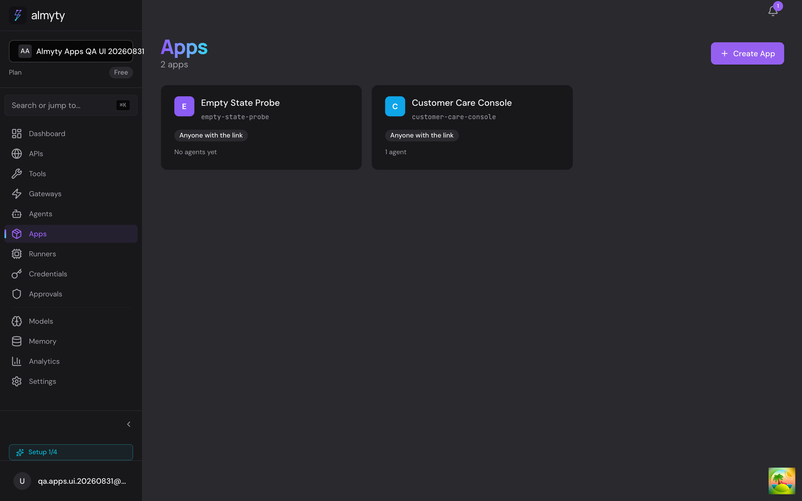
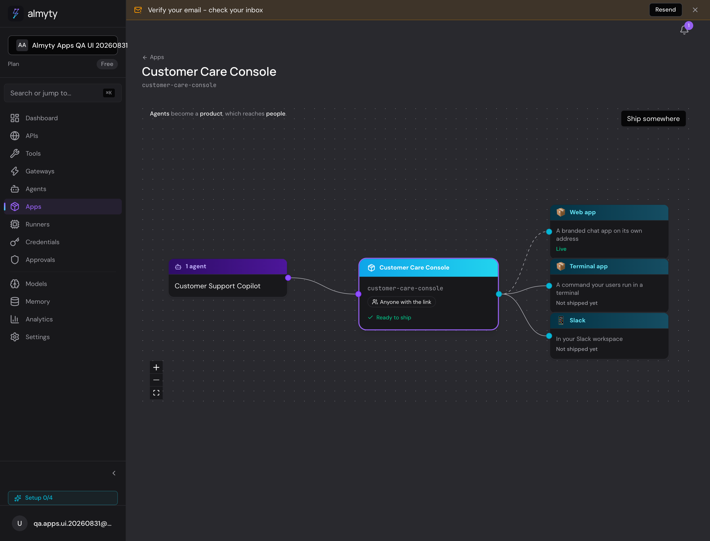
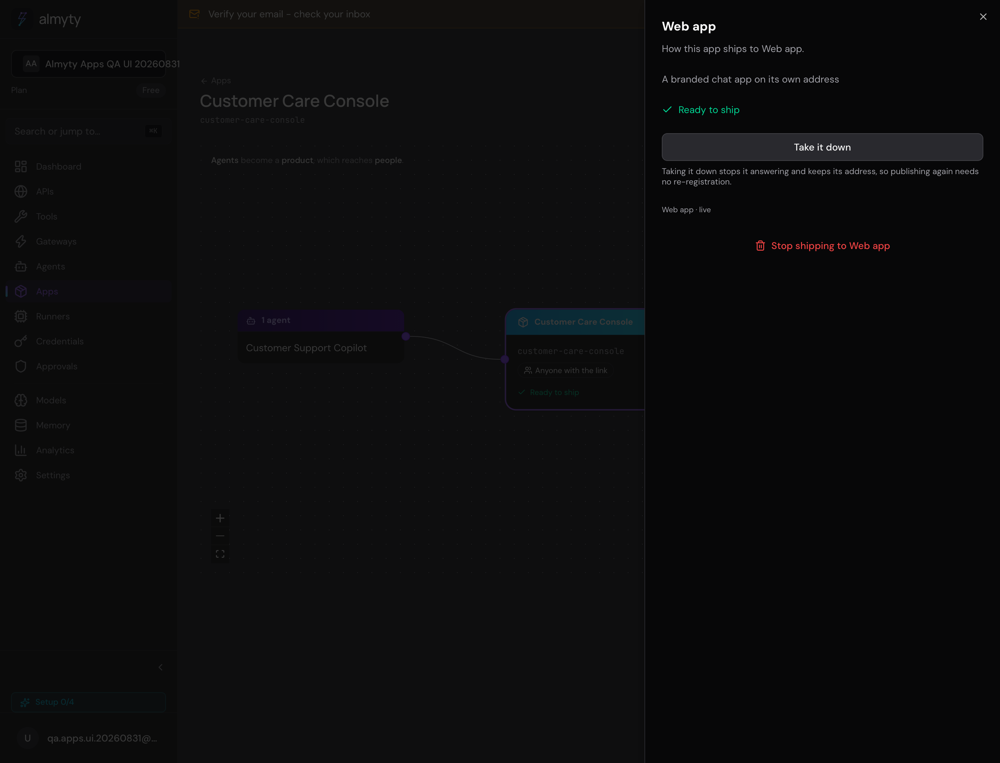
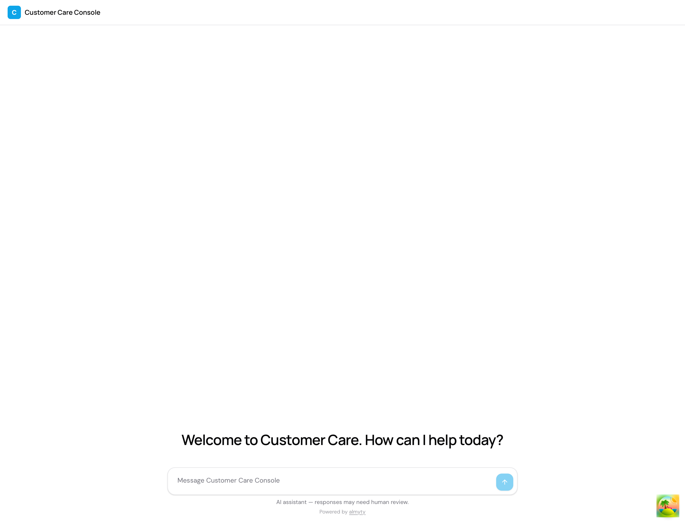
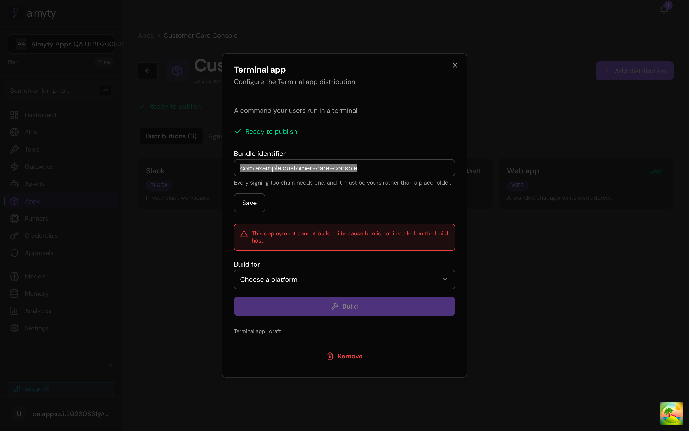

# Agent factory

The screen at `/apps`. It takes agents someone has already built and turns them into a product they ship under their own name: a hosted chat on its own address, a Slack or WhatsApp presence, a terminal command, a desktop app, a standalone binary.



## Why this exists

Every competitor terminates at a hosted widget, a messaging channel, or an API. All three keep the end user tethered to the vendor. A signed binary the customer hands to their own users does not: it carries their name, their identifier, their signature, and the operating system that asks who published it gets their answer, not ours.

That is the part nobody else ships, so it is the part this subsystem is built around.

## The three nouns

```
   Agent(s)              App                    Distributions
   capability     ->     product          ->    where it reaches people
   ─────────             ─────────              ─────────
   what it knows         what it is called      web       (hosted chat)
   which models          who may use it         slack, telegram, ...
   which tools           branding               tui       (terminal)
   how its loop runs     cost + rate limits     desktop   (installable)
                                                binary    (one executable)
```

**Agent** is a capability. **App** is a product decision: a name, a set of agents, branding, an auth mode, limits. **Distribution** is one place that product reaches people, and there is exactly one per target.

The separation is load-bearing. One agent appears in an internal app and a customer-facing one at the same time, under different names, different auth and different limits, without being duplicated.

The canvas makes that relationship explicit: agents feed one product, and the product fans out to each distribution independently.



Entities: `agent-app.entity.ts`, `agent-app-distribution.entity.ts`, `app-build.entity.ts`.

## Addressing

Everything is addressed by name. `/apps/acme-support`, `/apps/acme-support/distributions/slack`. The slug is unique per organization and is what the product ships under, so it is what an operator recognises and can type. An opaque id in a path is unreadable and unshareable for no gain.

## Publishing

Adding a distribution records where a product will ship. Publishing is the separate decision to let people reach it, and it is what turns a row into something that answers:

```
POST /apps/:slug/distributions/:target/publish
POST /apps/:slug/distributions/:target/unpublish
```

For every target except the three that compile to a file, publishing stands up a gateway of the matching type (`distribution-publish.ts` holds that mapping as one readable table) at `/apps/:slug/:target` — unique per organization, so it cannot collide with a hand-made gateway or with the same product's other surfaces.

The surface is created with the product's own branding and the product's own rate limits. Publishing with the limits dropped would make the check that allowed it theatre.

**Which agent answers** is per surface. A product can carry several, and the entity documents the first as the default — a fine default and a bad silent decision, because a support product with a triage agent and a billing agent should be able to put the billing one on the billing channel. A distribution may name its own in `configuration.agentId` and falls back to the default when it does not. Naming one that has since been removed from the product is refused rather than published, so a surface never answers with something the operator believes is no longer involved.

Publishing is idempotent: doing it twice re-syncs the existing gateway rather than failing on the unique endpoint, because the second attempt is usually someone reapplying a settings change.

Publishing refuses two things that would otherwise produce a surface that is live and useless. A platform whose credentials are absent (`REQUIRED_CREDENTIALS`, read off what each adapter actually uses, never invented) and a workflow agent behind a chat surface, which the runtime turns away at the first message with "not in autonomous mode".

For the hosted chat, publish writes the `hostedChat` block it is looked up by. Without it a published web app is a gateway `findBySlug` cannot see, which is what happened before.



The resulting hosted surface carries the product name, greeting, colour, disclosure, and public-session controls rather than the dashboard chrome.



Unpublishing **deactivates** the gateway rather than deleting it. Republishing keeps the same endpoint and whatever credentials were attached, so taking a product down for an afternoon does not mean re-registering a Slack app afterwards.

## What stops an app from shipping

`agent-app.rules.ts` returns the unmet rules continuously while someone is still editing, rather than letting them discover the list when a publish is rejected. The rules that matter:

- `PUBLIC_NEEDS_COST_CAP` — anyone with the link or the binary can spend against the customer's model keys.
- `PUBLIC_NEEDS_RATE_LIMIT` — one user must not be able to exhaust it for everyone else.
- `LOCAL_ACCESS_ON_PUBLIC` — a downloadable artifact that touches the machine it lands on cannot also be open to anyone.

An unset auth mode reads as open, not as unset. The permissive reading of missing configuration is the one that gets someone billed.

The first two are satisfied from the app's own `limits` column: a cost ceiling per run in cents, and per-user and per-IP request ceilings. Cents rather than currency because a ceiling in floating point is a rounding argument later; per-IP separately from per-user because a hosted chat visitor has no account.

A limit left empty is stored as null, not as zero. Zero would read as "no requests allowed" rather than "unset", and the rules treat both as unprotected — but only one of them is what the operator meant.

## Builds

A build runs on our machines and produces a file. It does not run on the customer's laptop, which is the difference between "download your app" and "install Node and run this command".

```
POST /apps/:slug/builds          queue one
GET  /apps/:slug/builds          history
GET  /apps/:slug/builds/:id/download    a link
GET  /apps/:slug/builds/:id/artifact    the bytes
```

Everything knowable up front is checked before queueing rather than inside the job — an unknown platform, a target that produces no file, a missing toolchain. Finding out twenty minutes into a queued job is worse than being told at once.

### Targets and platforms

| Target | Tool | Linux | Windows | macOS |
|---|---|---|---|---|
| `tui`, `binary` | `bun build --compile` | bare executable | `.exe` | bare executable |
| `desktop` | `electron-builder` | `.AppImage` | NSIS `.exe` | `.app` in a `.zip` |

`binary` compiles to byte-identical output to `tui` — same entry point, same invocation — so it is no longer offered when adding a distribution. The target still works and existing distributions still build; there is simply no reason to ask someone to choose between two names for one thing.

Everything cross-compiles. A Linux x64 ELF and a macOS arm64 Mach-O both build on a macOS host, and vice versa. The one exception is a macOS `.dmg`, which needs Apple tooling; the desktop target ships a zipped `.app` instead, which any Mac opens.

The extension depends on the target as well as the platform, which the platform table alone cannot express (`artifactExtension`). This is not cosmetic: a Mach-O executable named `.zip` does not open when double-clicked and browsers try to expand it.

### The icon

Without one, every customer's app wears the Electron logo, which undoes most of what a branded build is for. `build-icon.ts` fetches `branding.iconUrl` into `build/icon.png`, which electron-builder picks up by convention and derives the platform formats from.

That URL is customer input and the fetch runs from the build host's own network, so it goes through the same SSRF-safe agents the rest of the product uses: a link to `169.254.169.254` or to something on the internal network is refused at connect time. The bytes are checked for a PNG signature rather than trusted on the URL's extension or the server's content-type, and capped, because this file is handed to an image toolchain.

None of it ever fails a build. A default icon is worse than a branded one and far better than no artifact, so every path returns a sentence saying which happened.

### The desktop shell

`packages/desktop-shell` is an Electron window, identical for every customer. What differs is the `app-config.json` written beside it at build time, naming the product and the address it opens. No customer-authored code is packaged, and only the two files that ship are copied, so a developer's `node_modules` and tests never reach an artifact.

It renders remote content under someone else's name, so it is locked down to match: no Node in the renderer, `contextIsolation` on, permission requests refused outright, and navigation confined to the app's own origin.

That last check compares **origins**, not prefixes — `https://acme.almyty.app.attacker.test` passes a `startsWith` test — and treats a scheme with no host as no origin at all. `data:`, `file:` and `javascript:` URLs all report the origin string `"null"`, so an equality check alone would count them as each other, and as a build that has no address.

The address comes from `hostedChatUrl`, the same function the hosted surface uses. A second setting would drift from it.

`primaryColor` paints the window before the page loads, so a launch shows the customer's brand rather than flashing white, and tints the title bar where the platform supports it. The value is validated as a hex colour rather than passed through — it arrives from a form field and reaches the OS — and the symbol colour is chosen by Rec. 601 luma, whose green weight is what makes pure green read as light and pure blue as dark.

## Signing

The certificate is the customer's, so the signature is the customer's. That is the whole point, and it is why a private key reaches a build container at all.

| Platform | Tool | Steps |
|---|---|---|
| macOS | `rcodesign` | sign with hardened runtime, notarise, staple |
| Windows | `osslsigncode` | sign with an RFC 3161 timestamp |
| Linux | none | nothing to sign against |

A distribution names a `code_signing` credential, or the build stays unsigned and says so. Nothing is guessed: signing software with an identity nobody chose is not a convenience.

Rules the code holds to:

- **`signed` records what the tool did**, never what was attempted. An artifact that claims a signature it does not carry is how someone ships a binary the target OS refuses to open.
- **Signed is not notarised.** Gatekeeper enforces the notarisation ticket, not the signature, so a signed-but-unnotarised app still warns on download. The outcome carries both, and says so.
- **A half-filled credential is refused** before the tool sees it, rather than producing a build that looks signed.
- **The unsigned consequence is shown before the build**, not after. The moment to learn that macOS will refuse to open this is before sending the link to two hundred people.
- **`signingNote`** carries why a *working* build is unsigned. `error` means the build failed; a build that produced a usable binary and could not sign it succeeded, and the operator still needs the sentence.

### Handling the key

- `certificate`, `privateKey` and `certificatePassword` are in `Credential.SENSITIVE_FIELDS`, so they are encrypted at rest like any other secret. Whoever holds a signing certificate can publish software as the customer; it is no less sensitive than a password.
- Written `0o600` for the length of one build, and removed **before** the scratch directory is, so a failure to clean up the directory does not leave a private key behind.
- The Apple password goes via `--p12-password-file`. An argument list is readable through `ps` by every process on the host, and a build host runs other tenants' builds.
- The tool's own output goes to the build log, which stays server side. What reaches the operator is one sentence with absolute paths removed — a build panel is a web page, and the raw output names the path the certificate was written to.
- On macOS, `--binary-identifier` is set from the distribution's bundle id. A bare executable has no `Info.plist`, so without it every customer's binary identifies as whatever the compiler called it.

## Downloads

`StorageService.canPresign` decides the shape. S3 presigns and keeps the bytes off the API. Anything else streams through `GET /apps/:slug/builds/:buildId/artifact`, under the same ownership and expiry checks as the link.

The link is minted per request and short lived rather than stored, so a URL that ends up in a chat log or a ticket stops working. The artifact expires on its own schedule (`ARTIFACT_TTL_DAYS`), and an hourly repeatable job clears the bytes once it has — the expiry was enforced on download and nowhere else, so links stopped working on time while storage grew for ever. Override the cadence with `APP_ARTIFACT_SWEEP_CRON`.

The filename is the product, the version and the platform — that name lands in someone's Downloads folder next to everything else they have ever downloaded, and a row id tells them nothing.

### Who a run belongs to

`conversations.userId` carries a foreign key to `users`. A visitor on a published surface has no account, so a run they start carries `endUserId` and leaves `userId` null. A channel goes further: the platform's id for a sender (`U012ABC` on Slack) is not a UUID at all, so it lives in the run's metadata beside the thread and gateway ids.

Getting this wrong is not a tidiness problem. Attributing a visitor through `userId` made the insert inside the chat helper fail, so a hosted chat accepted a message, started a run, and died at the first model call with a constraint error nobody would connect to attribution.

## What a build host needs

| Tool | For |
|---|---|
| `bun` | `tui` and `binary` targets |
| `npx` | `desktop` target, via `electron-builder` |
| `rcodesign` | signing and notarising macOS artifacts |
| `osslsigncode` | signing Windows executables |

Desktop builds download the pinned Electron release, so the host needs outbound network at build time. `toolchainReadiness` and `signingReadiness` check for each before doing any work, and a deployment missing one says so in a sentence rather than failing obscurely.

`GET /apps/:slug/distributions/:target/capabilities` answers both before anyone presses Build, and the panel disables the button when the host cannot compile and warns separately when it can compile but not sign. Those are different problems with different fixes, so they are said separately.



The API image should remain lean. The recommended production layout is a dedicated build worker image, with an eventual option to isolate each build in an ephemeral Kubernetes Job. The trade-offs, security boundary, and rollout are in [Builder image topology](./builder-image-topology.md).

Two settings point at what the build packages, both falling back to the monorepo layout:

- `APP_BUILD_CLIENT_ENTRY`: the built terminal client. The API image installs `@almyty/chat` at `/opt/almyty` and points this at it.
- `APP_BUILD_DESKTOP_SHELL` — the Electron shell directory.

### A build is not interactive

`ProcessToolchainRunner` gives every tool `stdio: ['ignore', 'pipe', 'pipe']` and an environment containing only `PATH` and `HOME`.

The stdin part is not incidental. A pipe nobody writes to reads to OpenSSL as a console it can prompt on, so `osslsigncode` ignored the password it was handed and asked for one instead — which fails looking exactly like a bad certificate. The same command worked from a shell, which is what made it hard to see.

Nothing shells out to a string built from customer input either. A build takes a product name and a bundle identifier from a form, and those reach a process boundary.
