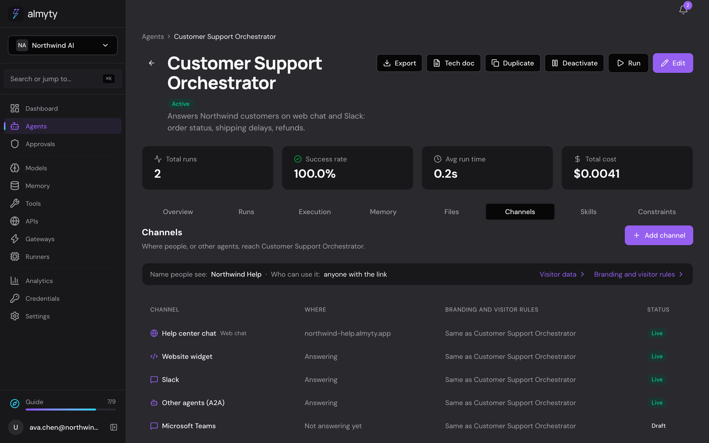
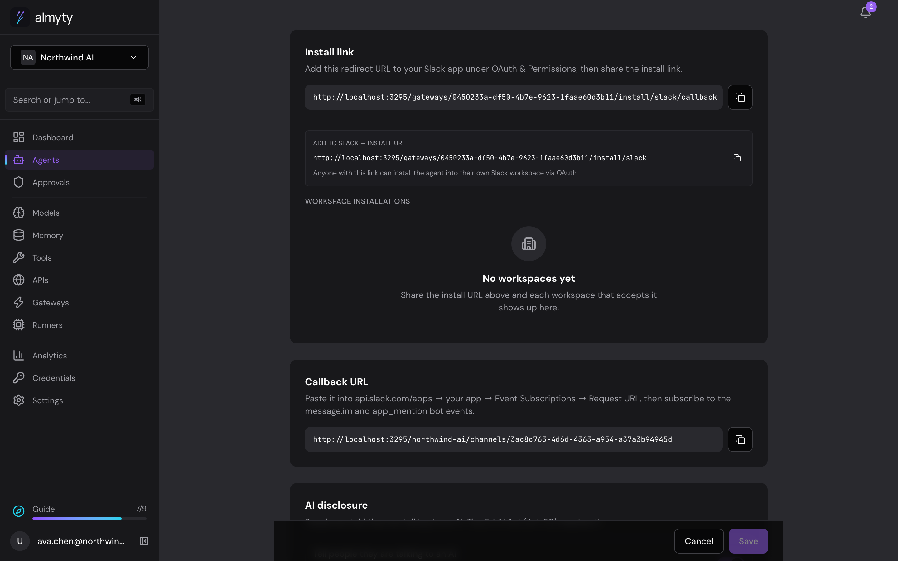
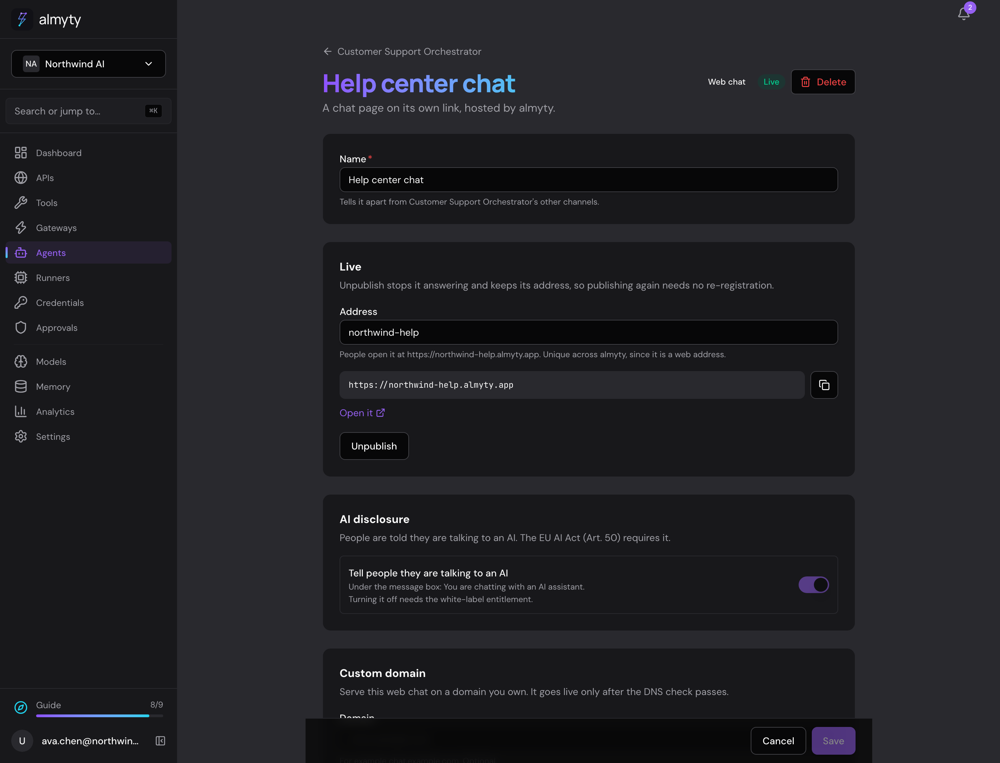
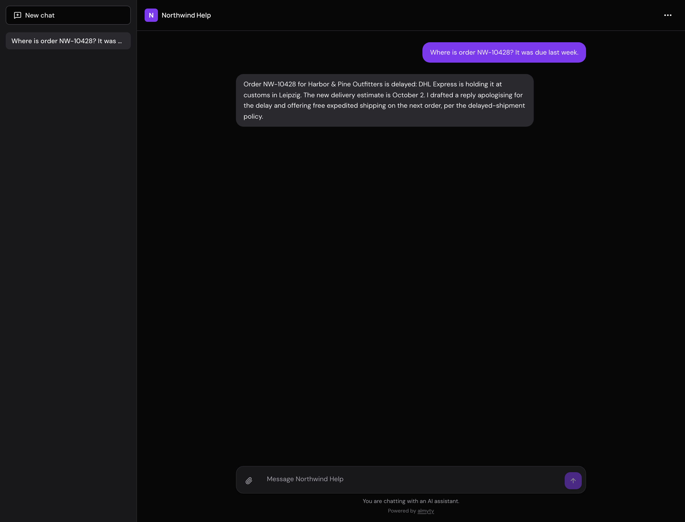
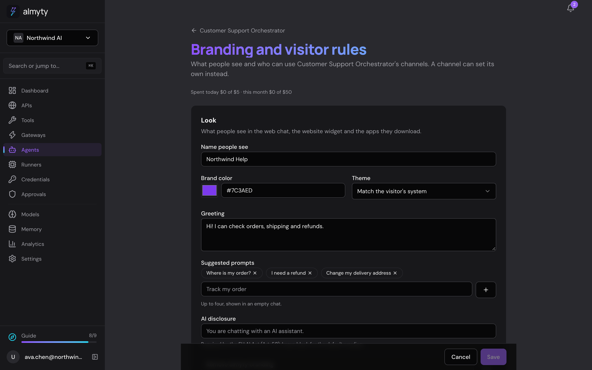
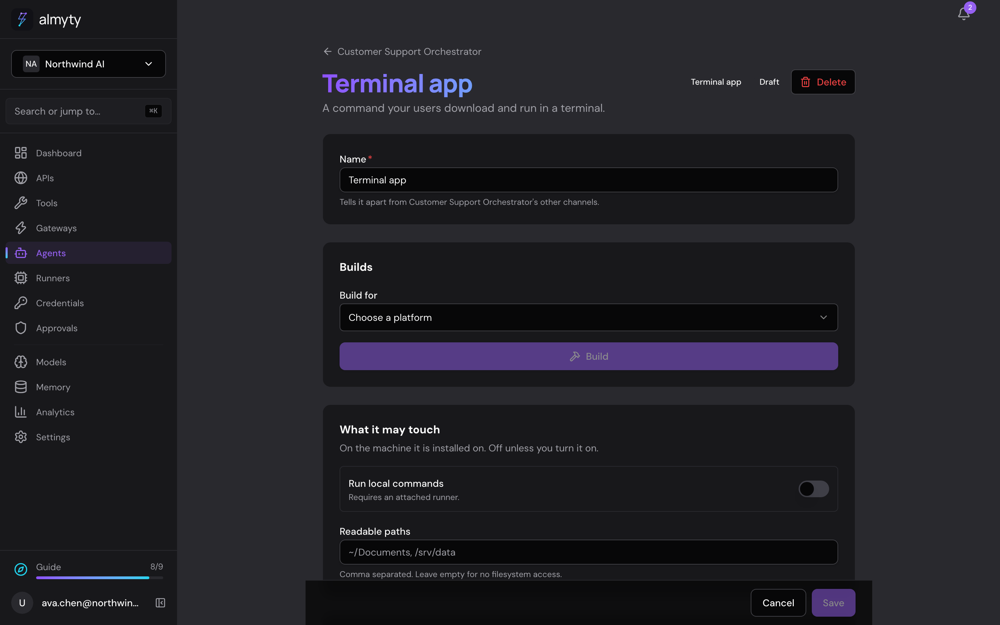

# Channels

An agent's **Channels** tab (`/agents/:id?tab=channels`). The agent's own API keys (for its API and the OpenAI-compatible endpoint) are on its Overview, next to the API snippets; a channel's keys are on that channel. It puts an agent someone has already built in front of people or other agents, under their own name: a hosted chat on its own address, a chat widget on their website, a Slack or WhatsApp presence, an A2A endpoint, a terminal command, a desktop app.



## Why this exists

A hosted chat, a widget, a messaging channel and an API all keep the end user on almyty's side. A signed binary the customer hands to their own users carries their name, their identifier and their signature, and the operating system that asks who published it gets their answer.

That is why builds and signing are a first-class part of this subsystem.

## The two nouns

```
   Agent                                  Channels
   capability + how it faces people  ->   where it reaches people
   ─────────                              ─────────
   what it knows, models, tools           web       (hosted chat)
   branding                               widget    (on your website)
   visitor rules: who may use it,         slack, telegram, ... (13 platforms)
     cost + rate limits, visitor data     a2a       (other agents)
                                          tui       (terminal)
                                          desktop   (installable)
```

**Agent** carries the capability and, in `agents.branding` and `agents.visitorRules`, how it faces the public: its name, look, who may use it, its limits and what it keeps about visitors. **Channel** (`agent_channels`, entity `agent-channel.entity.ts`) is one place that agent reaches people or other agents. One agent has many channels; a channel has exactly one agent (`agentId`, cascade on delete). A channel may override the agent's branding and visitor rules field by field (`agent_channels.branding`, `visitorRules`); `effectiveBranding` and `effectiveVisitorRules` in `agent-channels/channel-rules.ts` are the one merge everything reads.

The Channels tab is the only place a channel is added or edited: Create gateway makes only a tool gateway (MCP, UTCP or Skills), the server refuses a web chat, widget, messaging or A2A gateway no channel publishes, and the gateway page links back to its channel.

The tab is a DataTable of the agent's channels by name, with **Add channel** (`/agents/:id/channels/new`, a ChoiceTiles picker; picking a desktop app on an agent with no web chat offers, inline, to add both) and **Branding and visitor rules** (`/agents/:id/channels/settings`). A row opens the channel's page at `/agents/:id/channels/:channelId`, a FormPage holding its keys, publish state and type-specific sections. Signing credential creation has its own page beneath it at `/signing/new`.

Entities: `agent-channel.entity.ts`, `app-build.entity.ts` (`channelId`, `agentId`).

## Addressing

A channel is addressed by id under its agent: `/agents/:agentId/channels/:channelId`. A web chat also has a slug, unique across web chats and hosted-chat gateways, generated from the agent's name, which is its public address (`<slug>.almyty.app`).

## Publishing

Adding a channel records where an agent will be. Publishing is the separate decision to let people reach it, and it is what turns a row into something that answers:

```
POST /agents/:agentId/channels/:channelId/publish
POST /agents/:agentId/channels/:channelId/unpublish
```

For every type except the two that compile to a file, publishing stands up a gateway of the matching type (`channel-publish.ts` holds that mapping as one readable table, `GATEWAY_TYPE_FOR_CHANNEL`) at `/channels/:channelId`, so it cannot collide with a hand-made gateway or with another channel.

The gateway is created with the channel's effective rate limits. Publishing with the limits dropped would make the check that allowed it theatre.

Publishing is idempotent: doing it twice re-syncs the existing gateway rather than failing, because the second attempt is usually someone reapplying a settings change. A change to the agent's branding and visitor rules re-syncs every live channel's gateway.

**Every channel gateway belongs to a channel.** The gateway types a channel stands up (`CHANNEL_GATEWAY_TYPES` in `gateways/channel-surface.ts`: the hosted chat, the chat widget, A2A and the fifteen messaging platforms) are made only by `upsertForChannel`, which passes `forChannel` to `createGateway`. `createGateway` refuses one of these types without it (`CHANNEL_GATEWAY_NEEDS_AGENT`), so `POST /gateways`, the platform's own MCP tools and the CLI cannot make one outside a channel; `channel-gateways-belong-to-an-agent.spec.ts` holds `forChannel` to that one caller. The gateways that are not channels are the MCP, UTCP and Skills ones, which serve tools, not an agent.

**The website widget** (`widget`, a `chat_widget` gateway) takes its look from the agent and channel on every request: `GET /gateways/:id/widget-config` overlays the effective colour, name, greeting, theme, AI disclosure (unless the channel's switch is off, `disclosureOff`) and almyty mark, and keeps only the widget's placement (`configuration.widget.position`, `launcherIcon`), which republishing keeps (with the allowed sites). It has no sign-in, so it is refused on a channel whose effective auth mode is not `public_link` (`WIDGET_HAS_NO_SIGN_IN`, in both `checkChannel` and `checkPublish`); its rate limits are per visitor, like the web chat.

**A2A** (`a2a`) answers at `/{org}/channels/{channelId}` with its card at `.well-known/agent-card.json`, through the unified endpoint's channel lookup (`channelSurfaceSlug`). Callers sign in with the gateway's API keys, made on the channel's page. The card and JSON-RPC answer only for an active agent the gateway may serve (`findServableGatewayAgent`), and publishing refuses a workflow agent. Each caller credential has its own per-visitor share on the methods that start a task (`A2A_RUN_METHODS`).

Publishing refuses what would otherwise produce a channel that is live and useless (`PUBLISH_REFUSALS`): a platform whose keys are absent (`REQUIRED_CREDENTIALS`, read off what each adapter actually uses), a workflow agent behind a chat surface, an agent private to its owner, and a desktop app with no web chat to open (`DESKTOP_NEEDS_WEB_CHAT`).

Messaging channels take their keys from Credentials only: the channel page has the shared `CredentialPicker` (`components/credentials/credential-picker.tsx`), which lists that platform's credentials (`channel-<type>` connectors, and `channel-slack-app` for a Slack app's Add to Slack credentials) and creates one in place. The row keeps `credentialId` and `credentialKeys` (secret names only) and a copy of the credential's plain settings (`channelSettingsIn`: a phone number, a receiving address), which routing and the publish check read from the row; they are read again from the credential on every publish. A key sent in a channel's configuration (by the API or the `add_channel` MCP tool) is refused, and a write drops any key the row holds. Deleting a channel leaves its credential on Credentials.

**Where the platform delivers.** A messaging channel page shows its callback URL (`<api>/<org>/channels/<id>`) and says whether publishing registers it or it is pasted by hand (`CHANNEL_INBOUND` in `frontend/src/lib/agent-channels.ts`). Publishing registers it where the platform documents an API for that (`ChannelWebhookRegistrar`): Telegram `setWebhook`, the Twilio number's messaging webhook for WhatsApp and SMS, and Sendblue's account webhooks for iMessage via Sendblue (a `receive` webhook carrying the channel's webhook secret, scoped to its line). Unpublishing and deleting remove it. What the last attempt did is kept on the gateway (`metadata.webhookRegistration`), returned with the channel as `webhookRegistration`, and shown next to the URL: registered, or the platform's own reason it refused, with what to do. Registration runs after publish answers, so the page reads the channel again every two seconds until it is recorded. Everywhere else, LoopMessage included (it documents no webhook API), the page says where to paste the URL.

**iMessage** is reached through a relay, Sendblue or LoopMessage, picked when the channel is added. Both answer one-to-one and group chats: a group is one conversation keyed on the group, the member who wrote counts against their own visitor limit, and the reply goes to the group. In a group each message reaches the agent under its writer's short id, since the relays give a number and no name. Files someone sends, and files a reply links to, work as on every channel (below). A LoopMessage channel needs a sender name, entered on the channel page and required to publish (`SENDER_NAME_REQUIRED`); it is the channel's rather than the connection's because one LoopMessage key can carry several senders. Details and doc sources: `docs/interface-adapters-audit.md`.
Each channel has a `name`, unique among the agent's channels, so an agent can have several of one kind. A web chat's `slug` (its address) is generated from the agent's name and can be changed; it is a subdomain, so it is free across every organization and every hosted chat gateway (`freeSlug`).

**AI disclosure.** Every channel people talk to (`carriesDisclosure`: web, widget, messaging) has a switch, `configuration.aiDisclosure`, on unless false. A messaging channel's gateway gets the effective branding line (or `true` for the default) as `aiDisclosure`, which `applyAiDisclosure` prefixes to the first reply; the web chat and widget read the switch live through `ownerOf`. Off is a removal of the disclosure: saving it needs the white-label entitlement (`DISCLOSURE_REMOVAL_NOT_ENTITLED`), refused on save as well as at publish because the web surfaces read it live.



For the hosted chat, publish writes the `hostedChat` block it is looked up by: its address (the channel slug) and a mirror of the sign-in rule. Branding is not copied onto the gateway: `findBySlug` and `findByCustomDomain` overlay the effective look, sign-in rule and visitor rights on every request (`ChannelLinkService.withChannelSettings`, `ownerOf`, `hostedChatBlockFor`), so a change shows without republishing.



The web chat channel page carries the sign-in provider (presets first; a discovery URL only for Other; endpoints, keys and scopes under Advanced), the custom domain and the allowed sites, keyed by the channel's `gatewayId`.

A gateway a channel stood up is found from `agent_channels.gatewayId` (`GET /gateways/:id/channel`). Its page says which agent's channel it is, with a link back, and drops the settings the channel owns.



Unpublishing **deactivates** the gateway rather than deleting it. Republishing keeps the same endpoint and whatever keys were attached, so taking a channel down for an afternoon does not mean re-registering a Slack app afterwards. Deleting a channel deletes its gateway.

## What stops a channel from shipping

`checkChannel` in `channel-rules.ts` returns the unmet rules continuously while someone is still editing, rather than letting them discover the list when a publish is rejected. The rules that matter:

- `PUBLIC_NEEDS_COST_CAP`: anyone with the link or the binary can spend against the customer's model keys.
- `PUBLIC_NEEDS_RATE_LIMIT`: one user must not be able to exhaust it for everyone else.
- `LOCAL_ACCESS_ON_PUBLIC`: a downloadable artifact that touches the machine it lands on cannot also be open to anyone.

An unset auth mode reads as open, not as unset. The permissive reading of missing configuration is the one that gets someone billed.

The auth mode is enforced by the hosted-chat backend, not just displayed. A surface set to anything other than `public_link` answers `401 AUTH_REQUIRED` on every visitor endpoint (conversations, messages, stream, transcript) until the visitor has signed in the required way, and `GET /public/chat/:slug/me` tells the page which sign-in to show. Every sign-in ends in `bindAuthenticatedVisitor`, which attaches the verified identity to the visitor and rotates the session cookie. All sign-in routes live under `/public/chat/:slug/auth/` on the tenant host, so the session cookie travels with them.

- `email_otp`: a six-digit code mailed to the address, redeemable once, within ten minutes and five guesses, from the browser that asked for it. Counted as open for spend caps: anyone with an inbox passes.
- `oauth`: the surface's own identity provider, configured inline on the web chat channel page, presets first (Google, GitHub, one Microsoft Entra tenant, or any OpenID Connect or OAuth 2.0 provider; discovery documents are fetched through the SSRF gate when the provider is saved and must name the issuer they were read from). The client secret is stored only in `credentials`, as a row managed by the surface (`hosted_chat_oauth`). Each sign-in carries a state, a PKCE S256 verifier and, for OpenID Connect, a nonce, kept in Redis for ten minutes, bound to the visitor who started it and taken with `GETDEL`. The code is exchanged server-side through the SSRF-safe fetch, and ID tokens are checked against the provider's keys, issuer and client. The admin registers the redirect URIs the card shows: `https://{slug}.{base}/api/public/chat/{slug}/auth/oauth/callback`, plus the same path on the verified custom domain. An optional list of email domains admits only addresses the provider says it verified. Counted as open for spend caps: anyone with an account at a public provider passes.
- `sso` (commercial): the organization's own SSO configuration. For OIDC the visitor goes through `/auth/sso/login` and back to `https://{slug}.{base}/api/public/chat/{slug}/auth/sso/callback`. For SAML the same login sends an AuthnRequest whose ID is remembered; the IdP posts to `https://{slug}.{base}/api/public/chat/{slug}/auth/sso/saml/acs` (register it as an additional ACS URL for the SP entity; with SSO chosen, the web chat channel page shows the exact URL, and the verified custom domain's, with a copy button, from `GET /gateways/:id/hosted-chat-sso`), where the response must answer that request, pass node-saml's signature, audience and time checks, and be claimed once in the SAML replay cache. Because that POST is cross-site and carries no cookies, the identity is parked for two minutes and bound on a same-host GET that must present the state cookie set at login and come from the same visitor. An SSO surface on an organization without the `sso` entitlement closes rather than opening.

A surface whose mode has no working sign-in (OAuth without a provider, SSO without the entitlement) tells the visitor it is not accepting sign-ins rather than showing a button that goes nowhere.

The first two are satisfied from the effective `limits`: a cost ceiling per run in cents, and per-user and per-IP request ceilings. Cents rather than currency because a ceiling in floating point is a rounding argument later; per-IP separately from per-user because a hosted chat visitor has no account.

Those inputs live under Advanced on **Branding and visitor rules**, below the look, with their current values summed up in one line. A channel page can switch on its own branding and visitor rules; only the fields that differ from the agent's are stored.



A limit left empty is stored as null, not as zero. Zero would read as "no requests allowed" rather than "unset", and the rules treat both as unprotected, but only one of them is what the operator meant.

**Every channel runs under its policy.** `ChannelPolicyService` (gateways module) is the one place a web chat, widget, messaging channel or A2A call asks before a run: it resolves the channel and its agent from the gateway and hands the run options every channel starts with (`withChannelPolicy`): the effective per-run `costCapCents` as `maxCostCents`, `channelId` on the run, the channel's `gatewayId` on a new conversation (what retention and widget erasure find it by), and `metadata.appVisitor` with the effective `visitorMemory`, so a visitor with no end-user row (widget, channel, A2A) stays out of shared memory unless the agent opted in. Per-visitor shares are the web chat visitor, the widget thread, the channel sender and the A2A credential (`a2aCallerId`); `channel-policy.guard.spec.ts` reads the source so a new `startRun` on a channel cannot skip it.

**Spend cap.** `dailySpendCapCents` and `monthlySpendCapCents` on the agent bound all of its channels together: a missing field is the default for the auth mode (open: 500 and 5000, SSO: none, `spendCapsFrom`), null is none. A channel that sets either in its own visitor rules gets an allowance of its own (`ownSpend`) and is left out of the agent's pool. The policy sums `agent_runs.totalCost` over the UTC day and month (by `updatedAt`, so a thread open across midnight is counted; index `IDX_agent_runs_channelId_updatedAt`), counting the runs stamped with a `channelId`. Reached, the web chat, widget and A2A answer 429 with the code `CHANNEL_SPEND_CAP_REACHED` and "This chat has reached its limit for today." (or "for this month."), a messaging channel sends that sentence as its reply without a run, owners and admins get one `budget.alert` notification per period, and `GET /agents/:agentId/public-settings/spend` drives the notice on the Channels tab.

## Files, pictures, and who said what

**Files people send.** Every channel that delivers files hands them to the agent. The adapter records what its platform delivers (`InboundAttachment` in `adapters/base.adapter.ts`: a link, a platform handle, or the bytes themselves) and reads it the platform's way (`fetchAttachment`), through the egress guard (`safeFetch`: https, the address pinned at connect, each redirect re-checked with any `Authorization` header dropped when it leaves the origin), and with a credential only when the link is on the platform's own host.

| Channel | What arrives | How it is read |
|---|---|---|
| Slack | Files shared in the message | `url_private_download` with the bot token, `files.slack.com` only (scope `files:read`) |
| Telegram | A photo (its largest size) or a document; the caption is the text | `getFile`, then the bot's file URL |
| Discord | Message attachments | Their CDN link (`cdn.discordapp.com`, `media.discordapp.net`), no token |
| WhatsApp (Cloud API) | Image and document messages; the caption is the text | The media node with the access token, then its URL on `lookaside.fbsbx.com` with the token |
| WhatsApp, SMS (Twilio) | Media on the message (`NumMedia`, `MediaUrl{i}`) | The media URL on `api.twilio.com` with the account's credentials |
| Microsoft Teams | A pasted image; a file shared in a personal chat | The image from the Bot Framework's attachment service with the bot's token; the file by its pre-authorized SharePoint link, with nothing |
| Matrix | Unencrypted `m.image`, `m.file`, `m.audio`, `m.video` | The homeserver's authenticated media endpoint with the access token |
| Signal | Attachments | The bridge's `/v1/attachments/<id>` |
| Email | MIME attachments, the first five of up to 10 MB each | Their bytes, from the message itself |
| Webhook | `attachments: [{ url, type?, name? }]` in the payload | The https link, no credentials |
| iMessage | The relay's media links | The https link, no credentials |
| Web chat, widget | Uploads, below | Stored when uploaded |
| Google Chat | Attachments are named, not read | Chat serves their bytes only through its media API, with a service account or a user's authorization; the channel holds a webhook and a token |
| IRC | No files | |

A message is read for five files, each up to 10 MB and 20 seconds (`ChannelAttachmentReader`); the rest are named as not read. The bytes decide what a file is (`sniffMediaType`: the PNG, JPEG, GIF, WebP and PDF signatures): a claim of image or PDF the bytes do not bear out is not believed, and a web page served in place of a file is not taken for it. Images, PDFs and text files are stored in the files module (`FilesService.storeBytes`), filed under the conversation that reads them (`files.conversationId`) once the run has one, and the user message carries a reference to each (`{ type: 'file', fileId, mimeType, name, text }`, message `contentParts`), with a line naming it in the message text: `[Attachment: box.png (image/png, 2 KB)]`, which is what a transcript shows. Anything else (video, audio, an archive, HEIC) is named and not stored. A file stored for a run that is then refused is removed straight away.

**What the model gets.** When a model is called, `MessageAttachmentResolver` (`llm-providers/message-attachments.resolver.ts`) turns each reference into what that model can read. It runs at dispatch, once the provider and model are known, so it holds for the workflow engine and the autonomous runtime, for an explicit provider and for each routed candidate. The model's catalog card decides: `capabilities.vision` sends an image as image content (OpenAI `image_url` with a data URL, Anthropic an `image` block, Gemini `inline_data`), `capabilities.pdfInput` sends a PDF as a document (OpenAI `file`, Anthropic `document`, Gemini `inline_data`). Otherwise the model reads a text file's text, or a sentence saying what was sent and that it cannot open it. A model with no card is text-only, and so are Perplexity and a custom endpoint in its own format. The file is read from storage within the call's organization and checked against its bytes again; an image is sent up to 5 MB, a PDF up to 10 MB, and one request carries at most 20 MB, the rest as text. The bytes exist only in the outgoing request. The price feed fills `vision` and `pdfInput` on the cards (see `docs/models.md`, pricing).

A workflow run can carry files too: `input.attachments` (ids of files uploaded to `/files`, or `{ fileId, name, mimeType }`) go, after the text, to every `llm_call` whose prompt reads `{{input...}}`.

**Web chat and widget uploads.** `POST /public/chat/:slug/attachments` and `POST /gateways/:id/widget/attachments` (multipart `file`; the widget also sends `threadId`) store one file under its visitor: the web chat end user, or the widget thread. They count against the same surface and visitor limits as a message and take only images, PDFs (both by their bytes) and text files (`text/plain`, `text/csv`, `text/markdown`, `application/json`), up to 10 MB. A message names its files in `attachmentIds`, at most five; an id that is not that visitor's unsent upload on that surface is refused before anything is created. The widget makes up its thread id before its first message when a file is attached first. The web chat shows picked files above the message box and the widget above its input; each can be taken back before sending.

**Retention and erasure.** Conversation retention, the organization's and a channel's, removes a conversation's files, stored objects included, before the conversation (`FilesService.removeForConversations`). Deleting a web chat conversation, erasing a web chat visitor and erasing a widget thread do the same, and remove the visitor's uploads not sent yet. An attachment that never reached a conversation is removed a day after it was stored (`RetentionSweepService.sweepUnsentAttachments`). See `docs/retention.md`.

**Who wrote it.** In a conversation with several people, each message reaches the agent as "Name: text" (`channel-speaker.ts`): Slack channels and group DMs, Teams group chats and channels, Discord server channels, Telegram groups, Google Chat spaces, Signal groups, IRC channels, iMessage groups, and Matrix rooms (every room, since an event does not say whether a room is a direct chat). The name is the platform's display name when the delivery carries one (Slack asks `users.info` with the bot token when the event does not, scope `users:read`, cached for an hour; Matrix uses the user id's localpart). Otherwise, and whenever the name is an email address or has enough digits to be a phone number, it is `user-` and six hex characters derived from the sender's platform id: the same person reads the same in every message, and a contact detail never enters the transcript. One-to-one conversations are unchanged.

**Images and files in a reply.** What a reply links to goes out as media where the platform can send it (`reply-media.ts`): a markdown image, a markdown link to a file, a bare https URL ending in a file's extension, and any `attachments` the run returns. The platform fetches the file from the link; nothing is downloaded here except for Signal. The text then goes without those links, plus a line with the link of each file the platform could not send as media.

| Channel | Sent as media | Stays a link |
|---|---|---|
| Slack | Images, as image blocks | Other files |
| Telegram | Images (`sendPhoto`); GIF and PDF (`sendDocument`) | Other files |
| Discord | Images, as embeds | Other files |
| WhatsApp (Cloud API) | JPEG, PNG and PDF, each a message of its own | Other files |
| WhatsApp (Twilio) | JPEG, PNG and PDF (`MediaUrl`), one per message | Other files |
| Microsoft Teams | Images, as attachments | Other files (they need the file-consent flow) |
| Google Chat | Images, in a card | Other files |
| Signal | Images and PDFs, read through the egress guard (5 MB each) and attached | A file that could not be read |
| Email | Every file, attached by link (Resend fetches it) | |
| iMessage | Every file, as the relay's media | |
| SMS, Matrix, IRC | | Everything: MMS depends on the number, Matrix needs an upload to the homeserver, IRC has no files |
| Web chat, widget | | Everything: an image the agent names is shown as a link, so the visitor's browser does not fetch an address the agent chose the moment it paints |
| Webhook | | The text as written; the files also go in `attachments` |

## Custom domains

A hosted chat surface can also be served on a domain the tenant owns, set on the web chat channel page (the card is keyed by the gateway the channel was published as). The claim lives in the gateway's `customDomain` column, which no ordinary gateway save writes: only the custom-domain endpoints (`/gateways/:id/custom-domain`, `/verify`, and `DELETE`) change it, so an edit that loaded the gateway before a verify or removal cannot write the old claim back. A domain is served once its `_almyty-verify` TXT record proves control, and one hostname has at most one live owner across all organizations. Live domains are re-checked daily; after three definite misses in a row (a lookup error does not count) the domain stops being served and the organization's owners and admins are notified. A later claim that proves its own TXT record while the current holder's record no longer resolves takes the hostname over, demoting the holder in the same transaction.

## Builds

A build runs on our machines and produces a file. It does not run on the customer's laptop, which is the difference between "download your app" and "install Node and run this command".

```
POST /agents/:agentId/channels/:channelId/builds                queue one
GET  /agents/:agentId/channels/:channelId/builds                history
GET  /agents/:agentId/channels/:channelId/builds/:id/download   a link
GET  /agents/:agentId/channels/:channelId/builds/:id/artifact   the bytes
```

Everything knowable up front is checked before queueing rather than inside the job: an unknown platform, a channel that produces no file, a missing toolchain. Finding out twenty minutes into a queued job is worse than being told at once.

### Targets and platforms

| Channel | Tool | Linux | Windows | macOS |
|---|---|---|---|---|
| `tui` | `bun build --compile` | bare executable | `.exe` | bare executable |
| `desktop` | `electron-builder` | `.AppImage` | NSIS `.exe` | `.app` in a `.zip` |

Everything cross-compiles. A Linux x64 ELF and a macOS arm64 Mach-O both build on a macOS host, and vice versa. The one exception is a macOS `.dmg`, which needs Apple tooling; the desktop app ships a zipped `.app` instead, which any Mac opens.

The extension depends on the channel type as well as the platform, which the platform table alone cannot express (`artifactExtension`). This is not cosmetic: a Mach-O executable named `.zip` does not open when double-clicked and browsers try to expand it.

### The icon

Without one, every customer's app wears the Electron logo, which undoes most of what a branded build is for. `build-icon.ts` fetches the effective `branding.iconUrl` into `build/icon.png`, which electron-builder picks up by convention and derives the platform formats from.

That URL is customer input and the fetch runs from the build host's own network, so it goes through the same SSRF-safe agents the rest of the product uses: a link to `169.254.169.254` or to something on the internal network is refused at connect time. The bytes are checked for a PNG signature rather than trusted on the URL's extension or the server's content-type, and capped, because this file is handed to an image toolchain.

None of it ever fails a build. A default icon is worse than a branded one and far better than no artifact, so every path returns a sentence saying which happened.

An icon uploaded on the branding page (`purpose=app_icon`) is stored before the page is saved. One that no agent's or channel's branding names a day later is cleared by an hourly repeatable job on its own `channel-housekeeping` queue, registered on every process whatever `APP_BUILD_MODE` says, so a deployment with builds off still cleans up. Override the cadence with `UNSAVED_ICON_SWEEP_CRON`.

### The desktop shell

`packages/desktop-shell` is an Electron window, identical for every customer. What differs is the `app-config.json` written beside it at build time, naming the product and the web chat it opens (the channel's `webChatChannelId`, else the agent's first web chat). No customer-authored code is packaged, and only the two files that ship are copied, so a developer's `node_modules` and tests never reach an artifact.

It renders remote content under someone else's name, so it is locked down to match: no Node in the renderer, `contextIsolation` on, permission requests refused outright, and navigation confined to the web chat's own origin.

That last check compares **origins**, not prefixes. `https://acme.almyty.app.attacker.test` passes a `startsWith` test. It treats a scheme with no host as no origin at all. `data:`, `file:` and `javascript:` URLs all report the origin string `"null"`, so an equality check alone would count them as each other, and as a build that has no address.

The address comes from `hostedChatUrl`, the same function the hosted surface uses. A second setting would drift from it.

`primaryColor` paints the window before the page loads, so a launch shows the customer's brand rather than flashing white, and tints the title bar where the platform supports it. The value is validated as a hex colour rather than passed through (it arrives from a form field and reaches the OS), and the symbol colour is chosen by Rec. 601 luma, whose green weight is what makes pure green read as light and pure blue as dark.

## Signing

The certificate is the customer's, so the signature is the customer's. That is the whole point, and it is why a private key reaches a build container at all.

| Platform | Tool | Steps |
|---|---|---|
| macOS | `rcodesign` | sign with hardened runtime, notarise, staple |
| Windows | `osslsigncode` | sign with an RFC 3161 timestamp |
| Linux | none | nothing to sign against |

A desktop or terminal channel names a `code_signing` credential, or the build stays unsigned and says so. Nothing is guessed: signing software with an identity nobody chose is not a convenience.

Rules the code holds to:

- **`signed` records what the tool did**, never what was attempted. An artifact that claims a signature it does not carry is how someone ships a binary the target OS refuses to open.
- **Signed is not notarised.** Gatekeeper enforces the notarisation ticket, not the signature, so a signed-but-unnotarised app still warns on download. The outcome carries both, and says so.
- **A half-filled credential is refused** before the tool sees it, rather than producing a build that looks signed.
- **The unsigned consequence is shown before the build**, not after. The moment to learn that macOS will refuse to open this is before sending the link to two hundred people.
- **`signingNote`** carries why a *working* build is unsigned. `error` means the build failed; a build that produced a usable binary and could not sign it succeeded, and the operator still needs the sentence.

### Handling the key

- `certificate`, `privateKey` and `certificatePassword` are in `Credential.SENSITIVE_FIELDS`, so they are encrypted at rest like any other secret. Whoever holds a signing certificate can publish software as the customer; it is no less sensitive than a password.
- Written `0o600` for the length of one build, and removed **before** the scratch directory is, so a failure to clean up the directory does not leave a private key behind.
- The Apple password goes via `--p12-password-file`. An argument list is readable through `ps` by every process on the host, and a build host runs other tenants' builds.
- The tool's own output goes to the build log, which stays server side. What reaches the operator is one sentence with absolute paths removed, because a build panel is a web page and the raw output names the path the certificate was written to.
- On macOS, `--binary-identifier` is set from the channel's bundle id. A bare executable has no `Info.plist`, so without it every customer's binary identifies as whatever the compiler called it.

## Downloads

`StorageService.canPresign` decides the shape. S3 presigns and keeps the bytes off the API. Anything else streams through `GET /agents/:agentId/channels/:channelId/builds/:buildId/artifact`, under the same ownership and expiry checks as the link.

The link is minted per request and short lived rather than stored, so a URL that ends up in a chat log or a ticket stops working. The artifact expires on its own schedule (`ARTIFACT_TTL_DAYS`), and an hourly repeatable job clears the bytes once it has. The expiry was enforced on download and nowhere else, so links stopped working on time while storage grew for ever. Override the cadence with `APP_ARTIFACT_SWEEP_CRON`.

The filename is the product, the version and the platform. That name lands in someone's Downloads folder next to everything else they have ever downloaded, and a row id tells them nothing.

### Who a run belongs to

`conversations.userId` carries a foreign key to `users`. A visitor on a published surface has no account, so a run they start carries `endUserId` and leaves `userId` null. A channel goes further: the platform's id for a sender (`U012ABC` on Slack) is not a UUID at all, so it lives in the run's metadata beside the thread and gateway ids.

Getting this wrong is not a tidiness problem. Attributing a visitor through `userId` made the insert inside the chat helper fail, so a hosted chat accepted a message, started a run, and died at the first model call with a constraint error nobody would connect to attribution.

## What a build host needs

| Tool | For |
|---|---|
| `bun` | `tui` channels |
| `npx` | `desktop` channels, via `electron-builder` |
| `rcodesign` | signing and notarising macOS artifacts |
| `osslsigncode` | signing Windows executables |

Desktop builds download the pinned Electron release, so the host needs outbound network at build time. `toolchainReadiness` and `signingReadiness` check for each before doing any work, and a deployment missing one says so in a sentence rather than failing obscurely.

`GET /agents/:agentId/channels/:channelId/capabilities` answers both before anyone presses Build, and the panel disables the button when the host cannot compile and warns separately when it can compile but not sign. Those are different problems with different fixes, so they are said separately.



The API image should remain lean. The recommended production layout is a dedicated build worker image, with an eventual option to isolate each build in an ephemeral Kubernetes Job. The trade-offs, security boundary, and rollout are in [Builder image topology](./builder-image-topology.md).

Two settings point at what the build packages, both falling back to the monorepo layout:

- `APP_BUILD_CLIENT_ENTRY`: the built terminal client. The API image installs `@almyty/chat` at `/opt/almyty` and points this at it.
- `APP_BUILD_DESKTOP_SHELL`: the Electron shell directory.

### A build is not interactive

`ProcessToolchainRunner` gives every tool `stdio: ['ignore', 'pipe', 'pipe']` and an environment containing only `PATH` and `HOME`.

The stdin part is not incidental. A pipe nobody writes to reads to OpenSSL as a console it can prompt on, so `osslsigncode` ignored the password it was handed and asked for one instead, which fails looking exactly like a bad certificate. The same command worked from a shell, which is what made it hard to see.

Nothing shells out to a string built from customer input either. A build takes a product name and a bundle identifier from a form, and those reach a process boundary.
