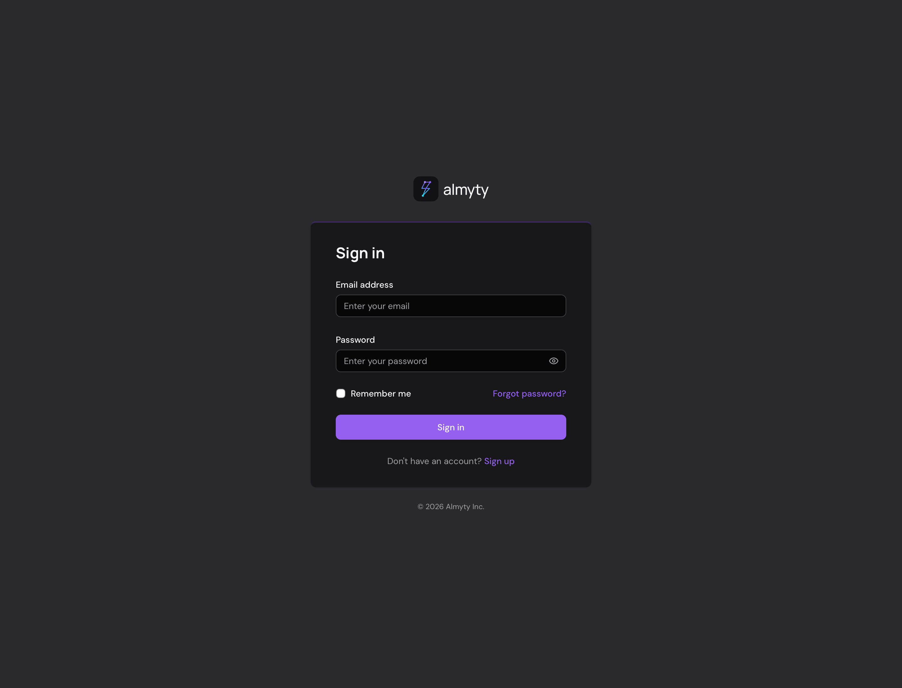
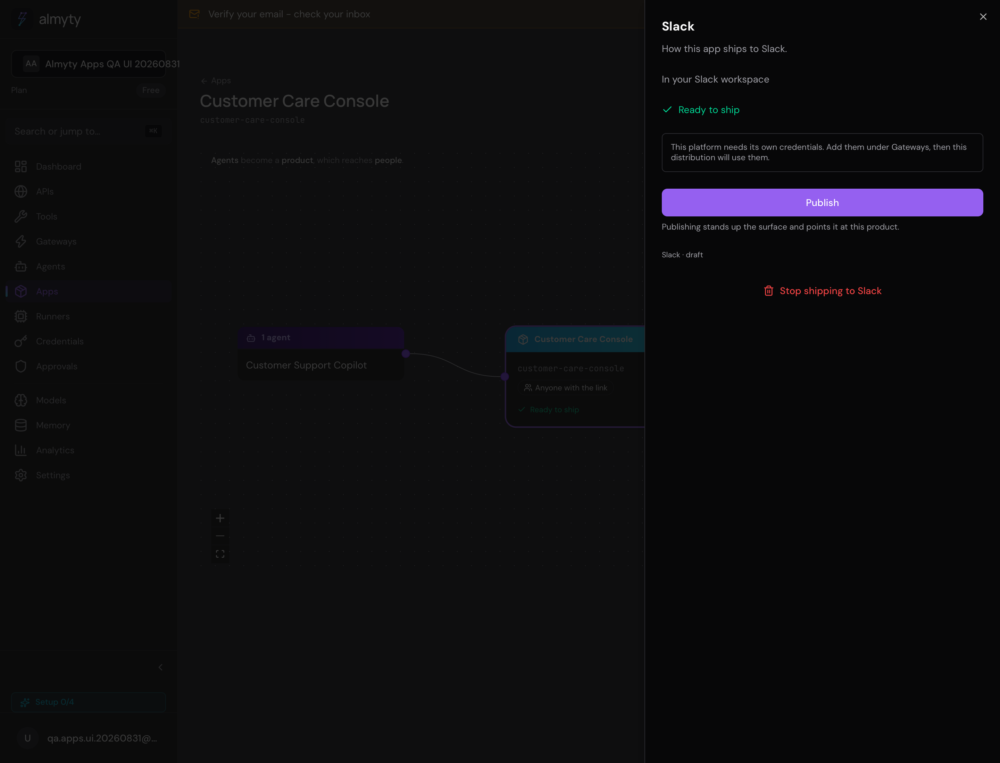

# Agent factory staging QA — 2026-08-31

Browser-driven with VibeSurfer against `app.staging.almyty.com`. A new organization, Mistral provider, autonomous support agent, and `Customer Care Console` app were created through the UI. The Web distribution was published; the public API and an end-to-end agent reply were verified against staging.

## Result

| Area | Result | Evidence |
|---|---|---|
| App list and canvas | Pass | App persists with one agent and Web, Terminal, and Slack distributions. |
| Web publish | Pass | Distribution becomes `live`; `GET /public/chat/customer-care-console` returns the configured branding. |
| Web unpublish and republish | Pass | **Take it down** changed the distribution to draft and the public API to HTTP 404. Publishing again restored the same address, `live` state, and HTTP 200 branding response. The app was left published. |
| Agent response | Pass after provider default was set | A public message produced a Mistral assistant reply and persisted both turns. |
| Hosted-chat hostname | Blocked | `https://customer-care-console.almyty.app` serves the dashboard sign-in page instead of the hosted-chat application. The staging API itself is live. |
| Slack publish | Blocked | The app panel says to add credentials under Gateways, but offers no gateway selector or credential fields. Publishing silently returns to the draft state. |
| Terminal build | Correct refusal | Staging reports that Bun is absent and disables Build. |

## Findings

### P0 — hosted-chat wildcard is routed to the wrong frontend

The published URL renders the ordinary sign-in page:

The staging API branding route returns HTTP 200, so the app record and hosted-chat gateway are present. The wildcard DNS/ingress/frontend deployment must route `*.almyty.app` to a frontend build containing tenant-host dispatch, with `/api` on the same host routed to the API.

### P1 — channel distributions cannot receive credentials from the app UI

`DistributionPanel` has no credential inputs or gateway selector, while publishing reads required credentials from the distribution's own `configuration`. An independently configured Gateway is not selected or reused. The panel also labels the distribution `Ready to ship`, and a failed Publish attempt exposes no actionable error in the panel.

### P1 — provider health check used the OpenAI fallback model

A Mistral key passed the pre-creation connection test and listed 44 models, but the saved provider was marked unhealthy because its background probe sent `gpt-4o` to Mistral. The app then accepted a public message but the run failed at the provider health gate.

The local fix makes health checks use the configured default model or discover the first provider-native chat model. The provider-list test dialog now renders `isHealthy: false` as a failure instead of showing a synthetic success.

### P2 — agent activation gave no feedback

The saved autonomous agent remained in Draft after using the actions-menu Activate command twice. No visible success or failure message explained the state. Web publishing still succeeded because app publishing does not require an active agent status.

## Safety checks

Turnstile was disabled only for account creation, restored immediately afterward, and verified against the original secret bytes. A negative registration probe after restoration returned `CAPTCHA verification failed`. The staging API deployment returned to two ready replicas.
