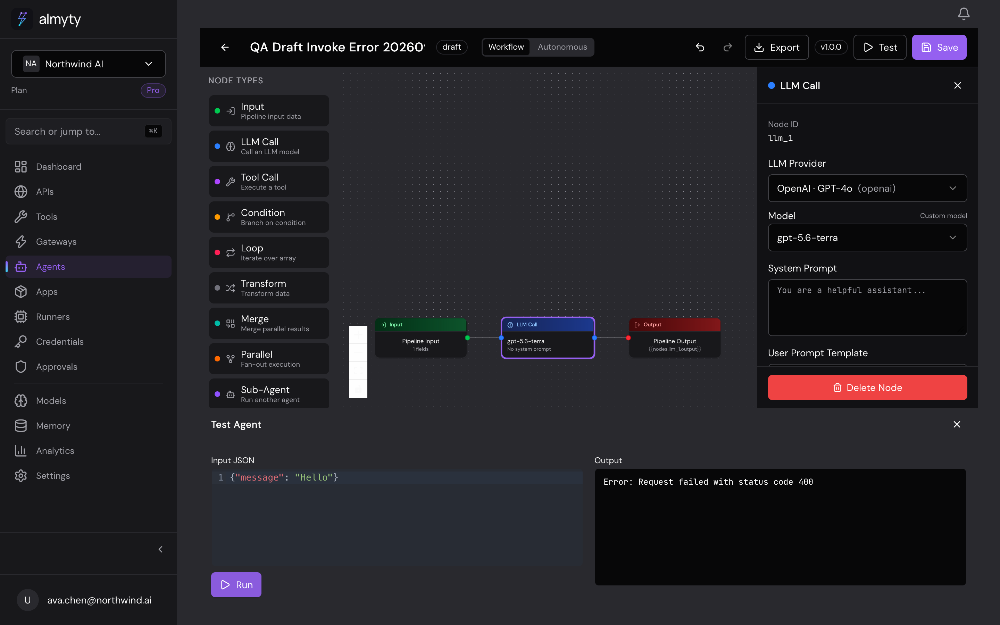

# Agent invocation error feedback — 2026-09-09

## Reproduction

Tested with VibeSurfer on `https://app.staging.almyty.com`, signed in as Ava in the Northwind AI QA organization. Created the disposable workflow **QA Draft Invoke Error 20260909**, saved it as a draft without activating it, then opened **Test** and clicked **Run**.

The backend correctly refuses to invoke a draft. The builder displayed only `Error: Request failed with status code 400`. The output text was absent from the browser accessibility snapshot; a screenshot showed that the screen was not actually blank.

## Cause and fix

`GlobalExceptionFilter` returns `{ error: { code, message, statusCode, ... } }`. The header Invoke dialog, builder Test panel, and Overview Try It were reading the older `response.data.message` location. They now use the existing `getApiErrorMessage` helper and render the backend reason in an accessible alert. A retry clears old errors; a new Invoke attempt also clears a stale successful result.

The activation requirement is unchanged. This fix does not activate agents or run draft workflows.

## Verification

- Focused component/helper tests: 10 passed. Coverage includes all three surfaces, exact wrapped backend text, local invalid JSON, retry recovery, and clearing stale results.
- Full frontend suite: 90 files / 675 tests passed. Frontend TypeScript and production build passed.
- Live pre-fix staging reproduction captured above. Post-deploy verification is tracked in the associated pull request.

The disposable draft remains available for the post-deploy retest; neither existing active agent was modified.
