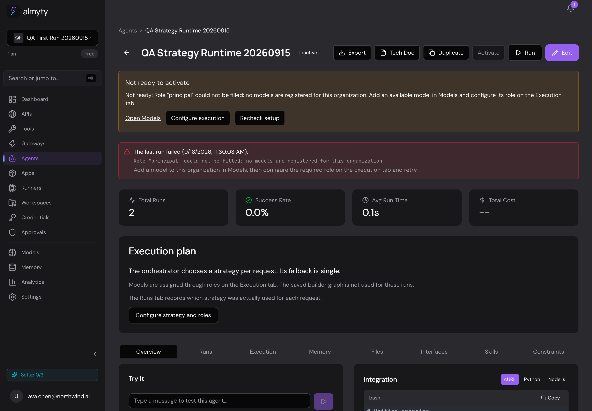
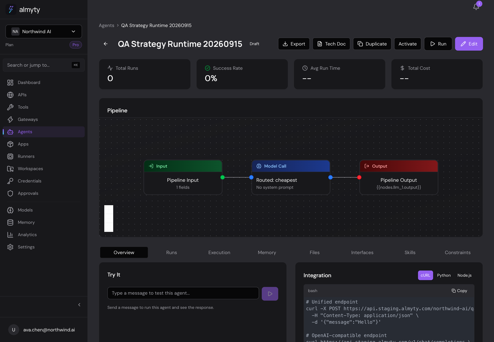
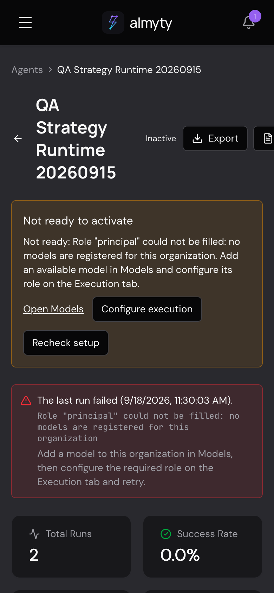
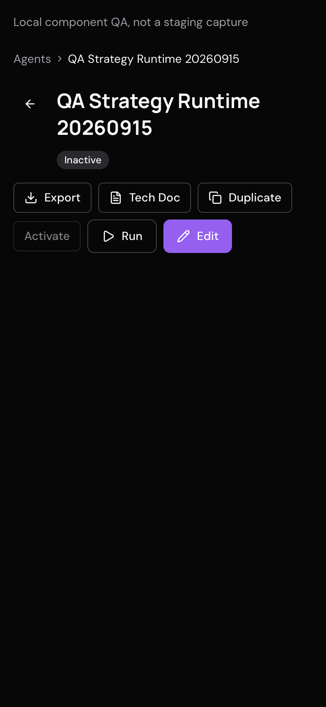

# Agent setup and execution-plan honesty — September 19, 2026

Follow-up to the confusing empty-catalog screenshot in the September 18 report.

## Fix scope

- Workflow activation checks the graph that actually runs (standing strategy,
  orchestrator fallback, or saved graph) and model/role bindings before saving
  ACTIVE. Create/update requests explicitly asking for ACTIVE use the same guard.
- Preflight does not call an LLM or ask the orchestrator to choose a strategy.
  It is a current configuration check, not a guarantee against future provider,
  credential, budget, tool, nested-agent or request-specific failures. Autonomous
  model-selection behavior is unchanged.
- A team-authorized, organization-scoped readiness endpoint drives a visible
  "Not ready to activate" state and configuration actions. Unavailable checks
  are distinct from missing configuration and cannot enable activation.
- Strategy-driven agents display their execution settings, not an unused saved
  builder graph. Orchestrator copy explicitly describes per-request selection
  and fallback; it does not pretend the next request's plan is already known.
- The last-run banner describes only the observed failure. It no longer asserts
  customer/channel impact. Role failures point to Models and the Execution tab.

## Verification

Before implementation, the activation regression failed because activation
resolved successfully despite missing model setup. Two banner tests failed on
the unsupported customer-impact claim and wrong configuration advice.

After implementation: 123 focused backend tests, 30 frontend tests, both
typechecks, EE build and EE dependency-wiring smoke passed. An additional guard
for creating an active strategy before its roles exist is covered separately.
PR [#648](https://github.com/almyty-inc/almyty/pull/648) passed full GitHub
[CI 35429313135](https://github.com/almyty-inc/almyty/actions/runs/35429313135),
including backend unit/DB integration, frontend tests, typecheck, security scans
and required audit jobs. It merged into development as `6b1aa3d4`.
Staging promotion [#649](https://github.com/almyty-inc/almyty/pull/649) merged as
`20ef72e5` after both development/promotion CI runs passed
(`35429591582`, `35429609496`).
Post-deployment desktop browser checks passed on September 20, as recorded below.
Public documentation base URLs were not changed.

CI repair ownership is separate: PR #646 fixes the previously reported baseline
failures. GitHub run 35428760991 passed backend unit/DB integration, frontend,
typecheck, security scans and required audit jobs. Those results do not stand in
for this branch's CI or live QA.

## Browser fixture and before state

VibeSurfer/WebKit, `app.staging.almyty.com`, seeded Ava test account, desktop
viewport 1440 × 1000. Organization: **QA First Run 20260915**, which intentionally
has no models. Agent: **QA Strategy Runtime 20260915**
(`bd605b9b-f7bf-4f15-9a4a-b8342a017451`). The agent is inactive; its two historic
failed test runs are preserved.

Before deployment (September 19, 07:33 UTC), Activate was enabled despite the
missing model; the saved builder graph appeared as the pipeline although the
orchestrator/strategy executes a compiled graph; and the historical error banner
asserted unverified app/channel impact.

## Initial deployment blocker (September 19, resolved)

The preceding CI-repair baseline's staging deployment failed **before
API/frontend rollout**. Migration
`HostedChatSlugUniqueness1750797000000` could not create
`UQ_gateways_hosted_chat_slug`: PostgreSQL `23505` identified duplicate
`customer-care-console` slugs. The migration transaction rolled back.
This was not a readiness-test failure. The running app remained on the old UI.
The migration owner was notified; no gateway records or addresses were changed
by this QA session. At that point, post-deployment verification was blocked.

## September 20 live verification

The collision fix merged in #651 and staging promotion #655. Staging revision
`8b411180d6c65f03f962b24cd9f7e7b27f5ee215` includes the readiness fix. Its
[image build](https://github.com/almyty-inc/almyty/actions/runs/35430784511)
passed. Deployment evidence confirmed staging migrations, both service rollouts
and post-deploy smoke checks passed on September 19. Private deployment links
are intentionally omitted.

VibeSurfer/WebKit browser checks on September 20:

- Empty-catalog fixture: **Not ready to activate** identifies the missing model
  for `principal`. Activate is visibly disabled; clicking it does not activate
  the agent. Recheck setup preserves that result.
- **Configure execution** opens the Execution tab and shows the same unresolved
  role. **Open Models** reaches the current organization's empty model catalog.
- The execution-plan card describes orchestrator selection per request and the
  `single` fallback. The unused saved graph no longer appears as the run plan.
- The historic failure remains visible, with Models/Execution guidance and no
  unsupported claim about customer or channel impact.
- Configured comparison: the separate same-named workflow draft in Northwind AI
  still shows its saved graph and an enabled Activate button, with no readiness
  warning. This is UI readiness evidence, not a successful model invocation.

No agents were activated, no providers or roles were changed, and the two
historic failed runs in the empty-catalog fixture were preserved.

## Mobile follow-up

At 390 × 844, the readiness guidance and actions wrap correctly, but the existing
agent header pushes its action buttons off the right edge. This follow-up changes
the header, title and action group to wrap and permits long names to break.

The new layout regression failed before the change; afterwards 19 focused tests
and frontend typecheck passed. A local VibeSurfer component fixture confirmed
the title and every action remain inside the viewport at 320, 390 and 1440 px.
The temporary fixture was removed after verification. This local result does
not claim the mobile layout fix is deployed yet.

