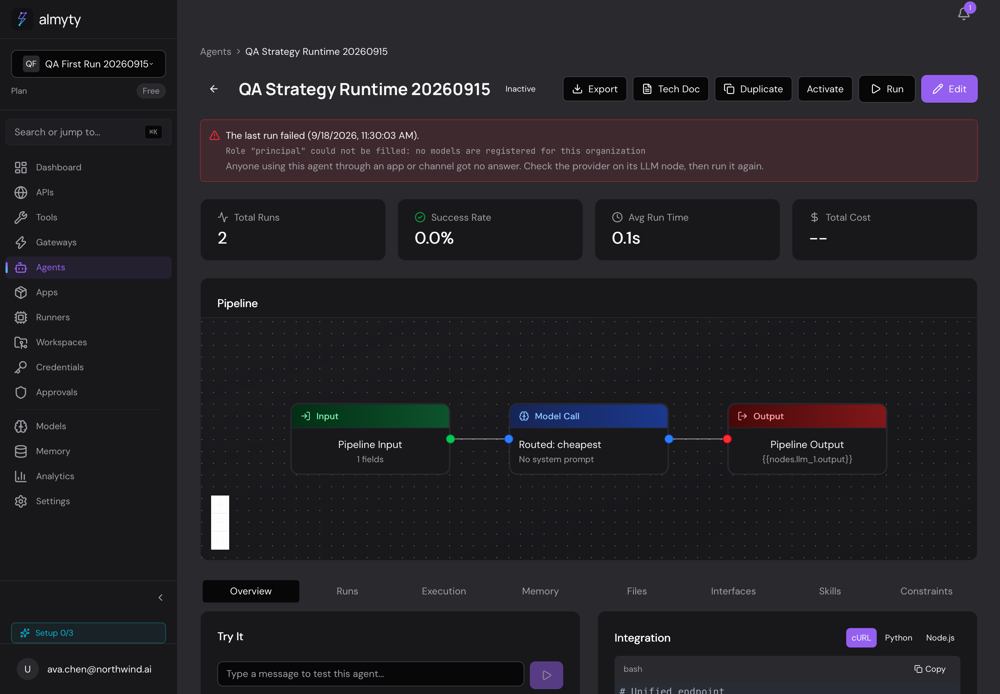

# Agent setup and execution-plan honesty — September 19, 2026

Follow-up to the confusing empty-catalog screenshot in the September 18 report.

## Fix scope

- Workflow activation checks the graph that actually runs (standing strategy,
  orchestrator fallback, or saved graph) and model/role bindings before saving
  ACTIVE. Create/update requests explicitly asking for ACTIVE use the same guard.
- Preflight does not call an LLM or ask the orchestrator to choose a strategy.
  It is a current configuration check, not a guarantee against future provider,
  credential, budget, tool, nested-agent or request-specific failures. Autonomous
  model-selection behavior is unchanged.
- A team-authorized, organization-scoped readiness endpoint drives a visible
  "Not ready to activate" state and configuration actions. Unavailable checks
  are distinct from missing configuration and cannot enable activation.
- Strategy-driven agents display their execution settings, not an unused saved
  builder graph. Orchestrator copy explicitly describes per-request selection
  and fallback; it does not pretend the next request's plan is already known.
- The last-run banner describes only the observed failure. It no longer asserts
  customer/channel impact. Role failures point to Models and the Execution tab.

## Verification

Before implementation, the activation regression failed because activation
resolved successfully despite missing model setup. Two banner tests failed on
the unsupported customer-impact claim and wrong configuration advice.

After implementation: 123 focused backend tests, 30 frontend tests, both
typechecks, EE build and EE dependency-wiring smoke passed. An additional guard
for creating an active strategy before its roles exist is covered separately.
PR [#648](https://github.com/almyty-inc/almyty/pull/648) passed full GitHub
[CI 35429313135](https://github.com/almyty-inc/almyty/actions/runs/35429313135),
including backend unit/DB integration, frontend tests, typecheck, security scans
and required audit jobs. It merged into development as `6b1aa3d4`.
Staging promotion [#649](https://github.com/almyty-inc/almyty/pull/649) merged as
`20ef72e5` after both development/promotion CI runs passed
(`35429591582`, `35429609496`).
Post-deployment browser evidence is still pending. Public documentation base
URLs were not changed.

CI repair ownership is separate: PR #646 fixes the previously reported baseline
failures. GitHub run 35428760991 passed backend unit/DB integration, frontend,
typecheck, security scans and required audit jobs. Those results do not stand in
for this branch's CI or live QA.

## Browser fixture and before state

VibeSurfer/WebKit, `app.staging.almyty.com`, seeded Ava test account, desktop
viewport 1440 × 1000. Organization: **QA First Run 20260915**, which intentionally
has no models. Agent: **QA Strategy Runtime 20260915**
(`bd605b9b-f7bf-4f15-9a4a-b8342a017451`). The agent is inactive; its two historic
failed test runs are preserved.

Before deployment (September 19, 07:33 UTC), Activate was enabled despite the
missing model; the saved builder graph appeared as the pipeline although the
orchestrator/strategy executes a compiled graph; and the historical error banner
asserted unverified app/channel impact.

## Deployment blocker (07:40 UTC)

The preceding CI-repair baseline's staging deployment failed **before
API/frontend rollout**. Migration
`HostedChatSlugUniqueness1750797000000` could not create
`UQ_gateways_hosted_chat_slug`: PostgreSQL `23505` identified duplicate
`customer-care-console` slugs. The migration transaction rolled back.
This was not a readiness-test failure. The running app remained on the old UI.
The migration owner was notified; no gateway records or addresses were changed
by this QA session, and no after-deployment result is claimed yet.
