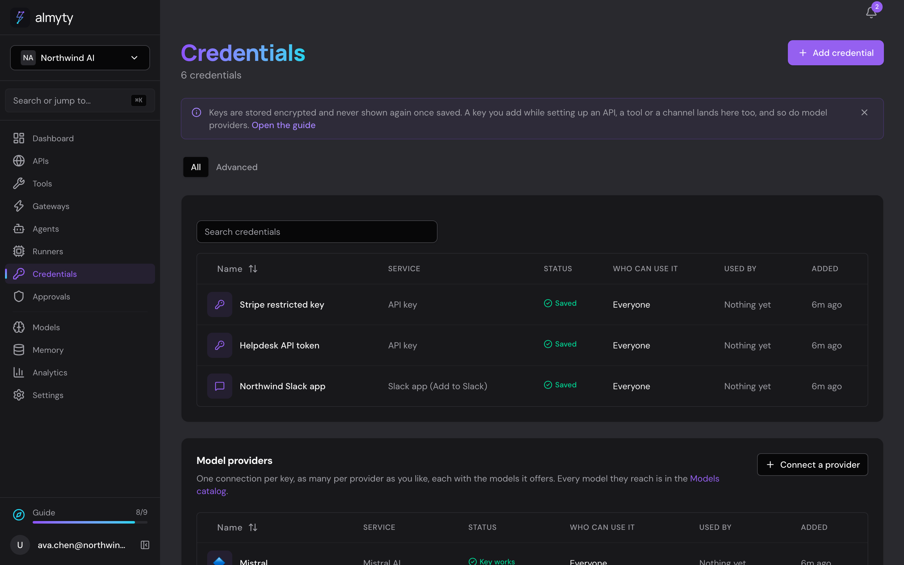
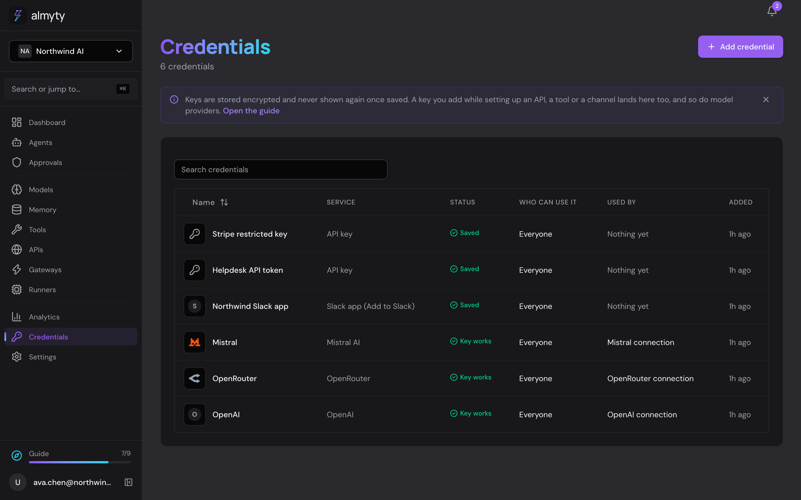
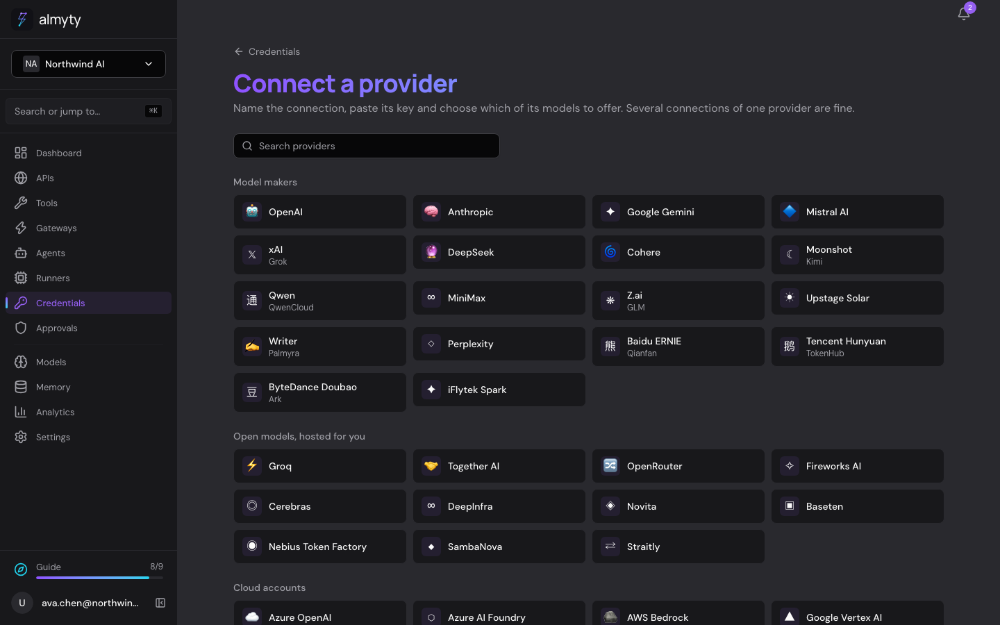
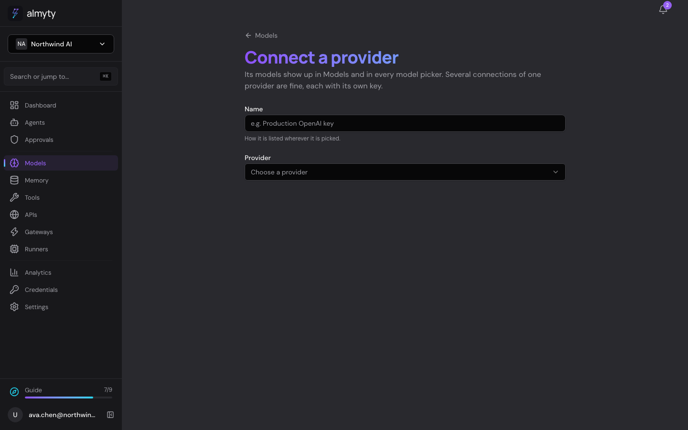
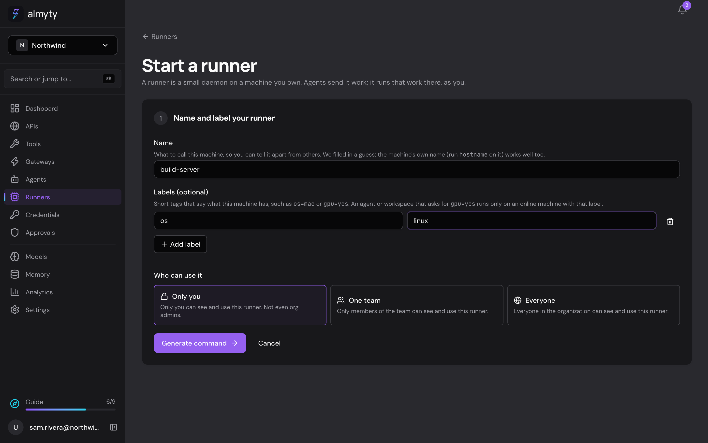
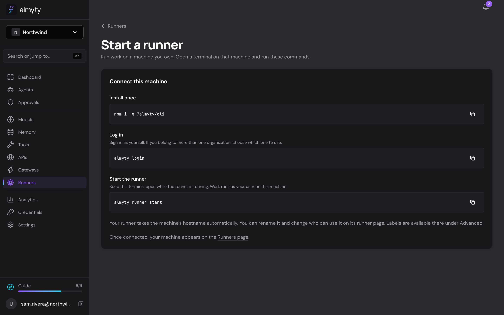
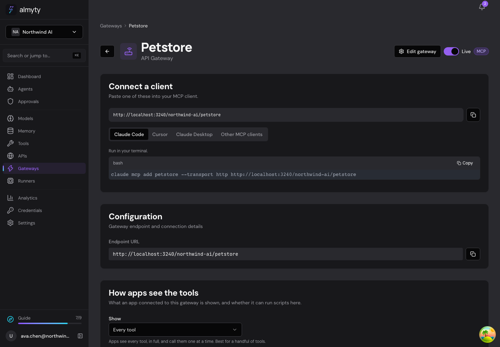
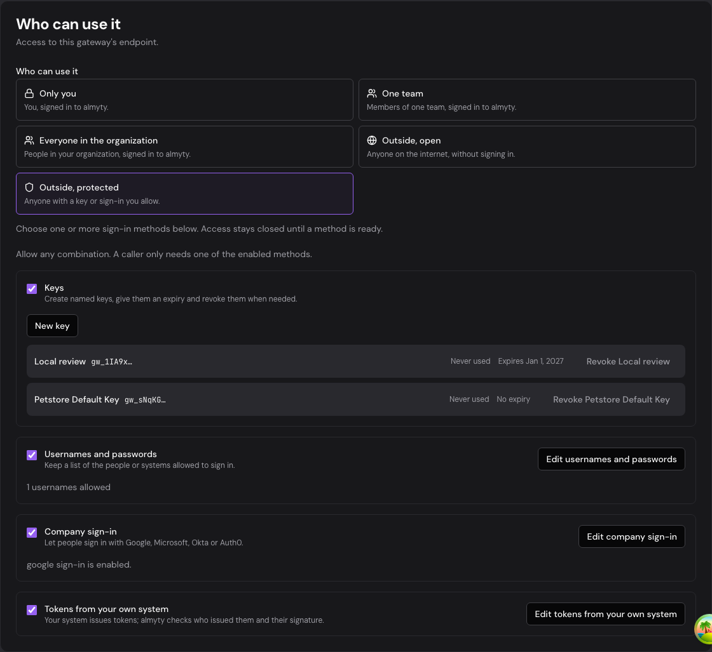

# Recovered Claude cleanup review

The recovered session stopped after saving the four-method access design. This branch completes the credentials/models/sidebar, memory/runner/CLI, and scoped endpoint access work, with current development integrated through 740a6068. No merge or deployment is authorized by this report.

## Validation

- Backend regression: 117 suites and 1,227 tests passed; one suite and 16 integration tests remain gated/skipped.
- Frontend regression: 43 files and 374 tests passed. The final gateway connection check added 15 passing tests after removing the obsolete internal-gateway key banner.
- Backend enterprise build and EE dependency injection smoke passed. Frontend TypeScript, lint and production build passed. Documentation production build and copy check passed.
- All 14 package lockfiles agree with their package definitions; all 51 API prefixes are proxied.
- Six local guide walkthroughs completed, producing 46 screenshots. Application captures refreshed 63 views. Screenshot inventory: 124 tracked, two explicitly pending captures inherited from development, zero errors.
- Browser checks saved a named key with expiry, a username/password, Google company sign-in configuration with a domain restriction, and JWT issuer/JWKS/audience configuration. Actual company-provider authentication was verified with signed mock-provider tests; live vendor accounts were not tested.

The demo uses isolated PostgreSQL/Redis and fake model/vendor systems. Script-trace and change-set screenshots use explicitly seeded local screenshot fixtures; they do not claim a real model-generated execution. No production or staging data was changed.

## Before and after

Before images below come from development. After images come from the local review branch. The access pair shows the organization scope before changing it to protected external access and configuring the four methods.

| Area | Before | After |
| --- | --- | --- |
| Credentials |  |  |
| Models |  |  |
| Runner setup |  |  |
| Endpoint access |  |  |

The blocked worker turns were stopped. Parent-side changes and checks completed the integration; no inaccessible worker approval remains part of this review.

Claude supplied three additional reviewed code-mode captures. The gateway capture accurately shows code mode disabled by this local server configuration. Claude retains follow-up ownership for two pre-existing defects discovered during his capture: a workflow code step waiting for approval is shown as failed, and widget messages can become separate untitled conversations. These are not fixed by this cleanup branch.
